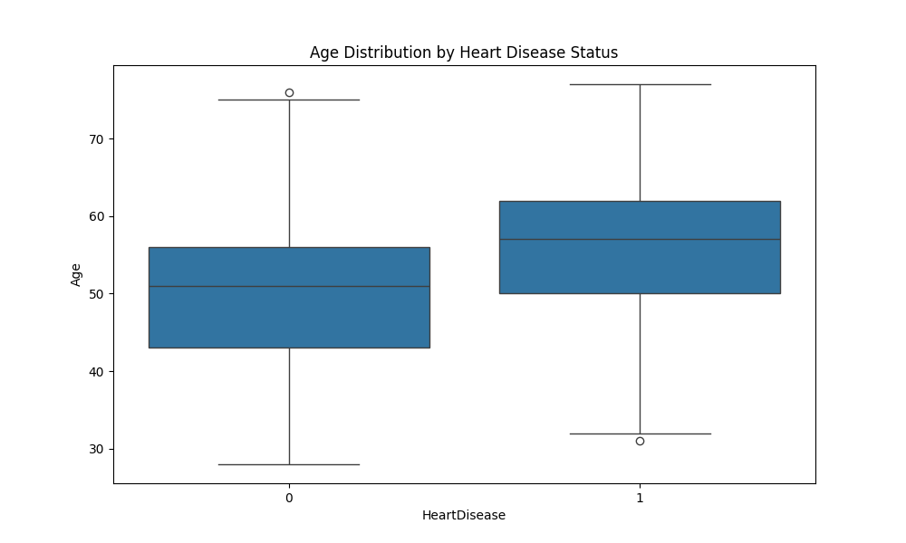
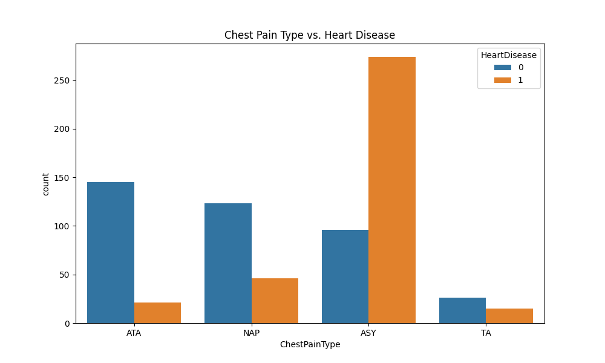
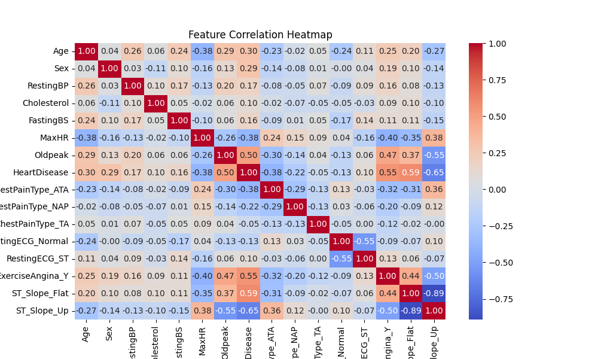
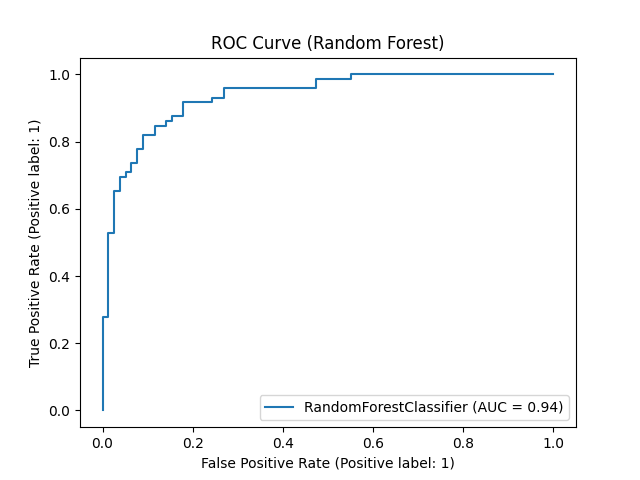
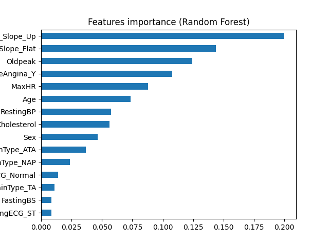
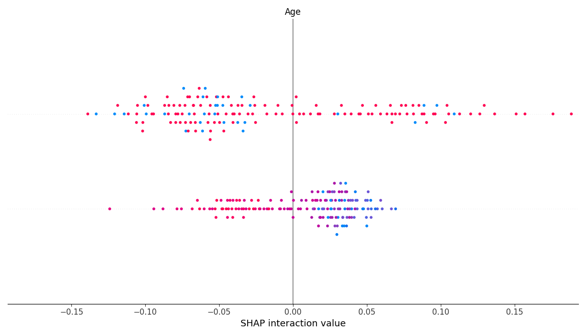

"# Heart-DISEASE-PREDICTION-SYSTEM"

## **Day 1: Exploratory Data Analysis**

### Key Findings

- **Age**: Patients with heart disease tend to be older (median ~58 vs. 53).
- **Cholesterol**: Higher cholesterol levels correlate with heart disease.
- **Sex**: Males have a higher prevalence of heart disease.
- **Chest Pain**: Asymptomatic chest pain is most common in heart disease patients.

### Visualizations





## Day 2: Model Building & Evaluation

### Key Results

- **Best Model**: Random Forest (F1-score: 0.86).
- **Top Features**: `Oldpeak`, `MaxHR`,`Age` and `ST_Slope`.
- **ROC-AUC**: 0.94.

### Visualizations





## **Day 3: Model Deployment**

### API Endpoint

`POST /predict`
**Input**:

```json
{
  "Age": 58,
  "Sex": 1,
  "ChestPainType_ATA": 1,
  "RestingBP": 140,
  "Cholesterol": 289,
  "MaxHR": 172,
  "Oldpeak": 0.0
}

**OUTPUT**:
{"prediction": 1}
