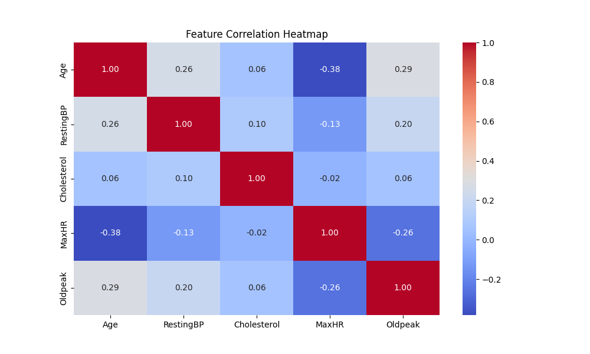
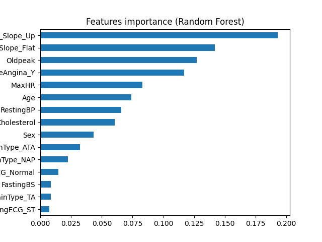

"# Heart-DISEASE-PREDICTION-SYSTEM" 

## **Day 1: Exploratory Data Analysis**
### Key Findings
- **Age**: Patients with heart disease tend to be older (median ~58 vs. 53).
- **Cholesterol**: Higher cholesterol levels correlate with heart disease.
- **Sex**: Males have a higher prevalence of heart disease.
- **Chest Pain**: Asymptomatic chest pain is most common in heart disease patients.

### Visualizations

## Day 2: Model Building & Evaluation  
### Key Results  
- **Best Model**: Random Forest (F1-score: 0.89).  
- **Top Features**: `Oldpeak`, `MaxHR`, and `ChestPainType_ATA`.  
- **ROC-AUC**: 0.93.  

### Visualizations  
  
  